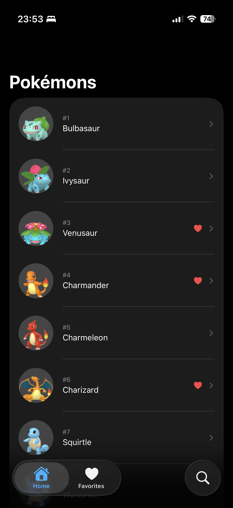
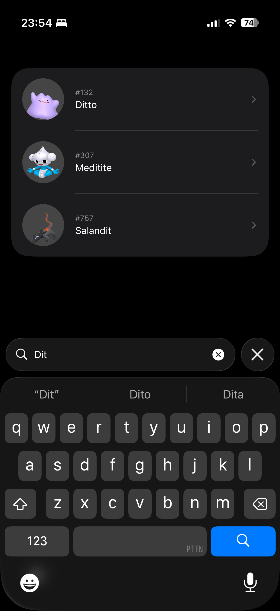
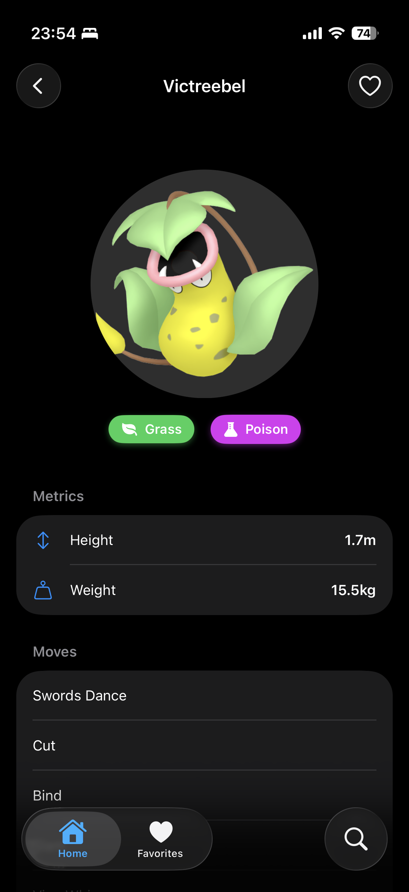
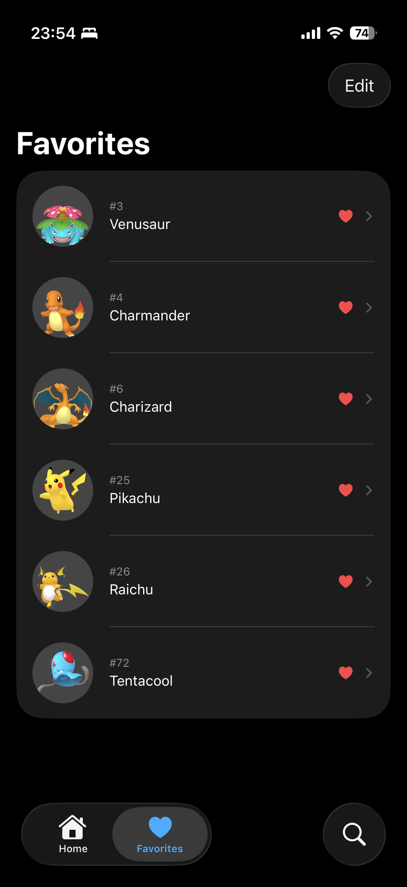

# PokeBase

PokeBase é uma enciclopédia Pokémon moderna construída nativamente para iOS, focada em performance, design fluido e suporte offline. O aplicativo permite que treinadores explorem o vasto mundo Pokémon, busquem por espécies específicas e gerenciem sua própria "Party" de favoritos com persistência de dados local.

## 🎯 Objetivo

O principal objetivo do PokeBase é servir como uma vitrine de implementação técnica utilizando as tecnologias mais recentes da Apple (**SwiftUI**, **SwiftData**, e o framework **Observation**). Ele demonstra como lidar com consumo de APIs REST, processamento de imagens de forma eficiente e gerenciamento de estado complexo em um ambiente mobile moderno.

## ✨ Funcionalidades

- **Exploração Completa:** Navegue por uma lista extensa de Pokémons consumindo a PokeAPI.
- **Busca em Tempo Real:** Filtre e encontre Pokémons instantaneamente por nome.
- **Detalhes Ricos:** Visualize estatísticas, tipos (com cores dinâmicas), métricas de peso/altura e movimentos.
- **Sistema de Favoritos (Minha Party):** Adicione Pokémons aos seus favoritos para acesso offline.
- **Persistência com SwiftData:** Seus Pokémons favoritos ficam salvos no dispositivo, mantendo os dados mesmo sem conexão com a internet.
- **Navegação Moderna:** Utiliza `NavigationStack` com navegação baseada em tipos para uma experiência de usuário fluida.

## 🛠 Tecnologias e Arquitetura

- **Linguagem:** Swift 6.0
- **UI:** SwiftUI
- **Persistência:** SwiftData
- **Gerenciamento de Estado:** Framework @Observation
- **Rede:** URLSession (Async/Await)
- **Arquitetura:** MVVM + Store Pattern (para separação clara de responsabilidades e lógica de negócios)

## 📁 Estrutura do Projeto

```text
PokeBase/
├── App/            # Ponto de entrada e configuração global
├── Models/         # Modelos de domínio e modelos do SwiftData (@Model)
├── Network/        # Camada de rede, Mappers e tradução de dados da API
├── Store/          # Serviços globais e gerenciamento de estado (Single Source of Truth)
├── ViewModels/     # Lógica específica de cada tela e orquestração de dados
├── Views/
│   ├── Components/ # Peças de UI reutilizáveis (Badges, Cells, ImageView)
│   └── Screens/    # Telas principais (List, Search, Detail, Favorites)
└── Utils/          # Extensões, Constantes e estilos de tipos Pokémon
```

## 📸 Screenshots

Aqui estão as principais telas do aplicativo que demonstram a interface e fluxo do usuário:

| Lista de Pokémons | Busca | Detalhes | Favoritos (Party) |
|:---:|:---:|:---:|:---:|
|  |  |  |  |

## 🚀 Como Executar

1. Certifique-se de ter o **Xcode 15.0+** instalado.
2. Clone este repositório: `git clone https://github.com/seu-usuario/pokebase.git`
3. Abra o arquivo `PokeBase.xcodeproj`.
4. Selecione um simulador de iPhone (recomenda-se iPhone 15 ou superior).
5. Pressione `Cmd + R` para rodar.

---
Desenvolvido por Filipe Fernandes - 2026.
